# Watson Event Buddy
In this developer journey we will build a Watson Event Buddy which is a cognitive chatbot designed to help users easily find and purchase event tickets based upon a machine learning model.

When the reader has completed this journey, they will understand how to:

* Build a Watson Event Buddy that converses using Watson Conversation
* Use Watson Text to Speech to converse with Event Buddy
* Use Watson Machine Learning to recommend what type of event is of interest to the user (ie: art, music, sport)
* Use Ticketmaster API to search for events based upon location, type and date
* Use Twilio to send SMS text messages with link to purchase tickets from Ticketmaster

### Included Components

* [Watson Conversation](https://www.ibm.com/watson/developercloud/conversation.html): Build, test and deploy a bot or virtual agent across mobile devices, messaging platforms, or event on a physical robot.
* [Watson Text to Speech](https://www.ibm.com/watson/developercloud/text-to-speech.html): Converts written text into natural sounding audio in a variety of languages and voices.
* [Node-RED](https://console.bluemix.net/catalog/starters/node-red-starter): A flow-based development tool for wiring together hardware devices, APIs and services.
* [Watson Machine Learning](https://www.ibm.com/cloud/machine-learning): Create, train, and deploy self-learning models

### Featured Technologies

* [Twilio](https://www.twilio.com/): Integrate voice, messaging, and VoIP into your web and mobile apps.
* [Ticketmaster](https://developer.ticketmaster.com/products-and-docs/apis/getting-started/): A leading provider platform for purchasing and selling event tickets for concerts, sports, arts, theater and other events.

# Steps
1. [Clone the repo](#1-clone-the-repo)
2. [Create the Bluemix Services](#2-create-bluemix-services)
3. [Create Machine Learning Model](#3-create-machine-learning-model)
4. [Configure Watson Conversation](#4-configure-watson-conversation)
5. [Register for Ticketmaster Service](#5-register-for-ticketmaster-service)
6. [Register for Twilio Service](#6-register-for-twilio-service)
7. [Enable and Configure NodeRED Service](#7-enable-and-configure-nodered-service)
8. [Deploy Client Application](#8-deploy-client-application)

## 1. Clone the repo

Clone the 'WatsonEventBuddy' locally. In a terminal, run:

`$ git clone https://github.com/loren-murphy/WatsonEventBuddy.git`

We’ll be using the files within the [`docs`](docs) folder.
* EventBuddy-NodeRedFlow.json
* Ticket_Data.csv
* workspace_wcs-eventbuddy.json

## 2. Create Bluemix services

Create the following services:
  * [**Node-RED Starter**](https://console.bluemix.net/catalog/starters/node-red-starter)
  * [**Watson Conversation**](https://console.ng.bluemix.net/catalog/services/conversation)
  * [**Watson Text to Speech**](https://console.ng.bluemix.net/catalog/services/text-to-speech/)
  * [**Apache Spark**](https://console.bluemix.net/catalog/services/apache-spark)

## 3. Create Machine Learning Model

Login to [Data Science Experience](https://datascience.ibm.com/). If you do not have an account, you will need to create one.

Create a **new project** called **"Event Buddy"**. If not already done, provision an Object Storage and Spark service.

Click the **Assets** tab, and beside the **Models** section, click **New Model**

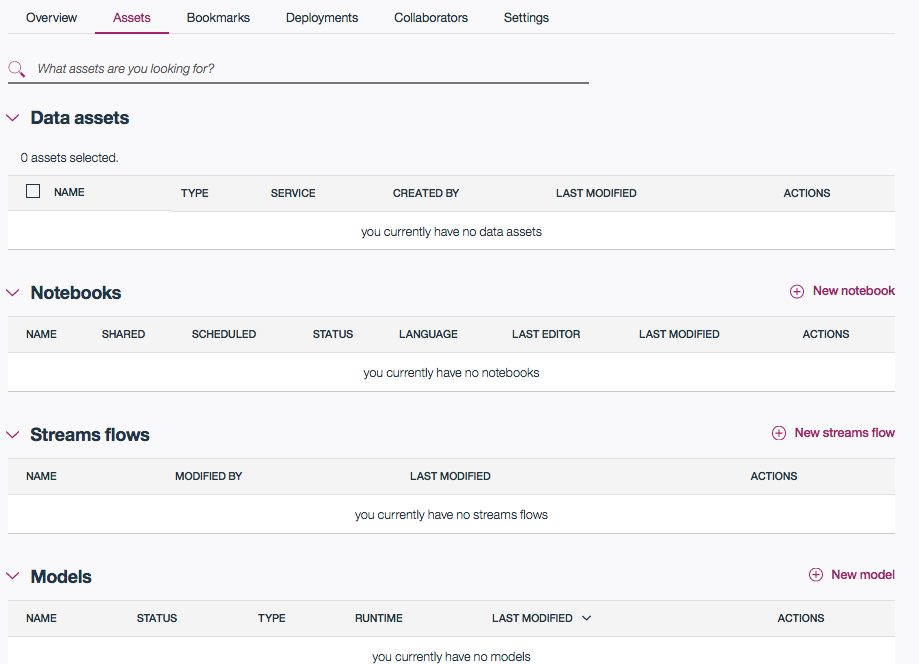

Name the model **"Event Buddy ML"**. Select the Spark Service, Machine Learning Service and model type as **Manual**. When done, select **Create.**

 If you do not have a Machine Learning or Spark Service Instance associated with the project, **provision an Instance**.

 

Now we need to upload the dataset to create the Machine Learning model. Select **Add Data Assets** and upload the [`Ticket_Data.csv`](docs/Ticket_Data.csv) file. When done, select **Next**. 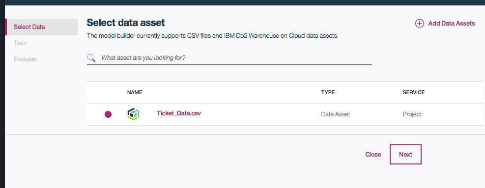

Select **Segment (String)** as the column value to predict.Feature columns is **All (default)**. Select **Multiclass Classification** as the technique. 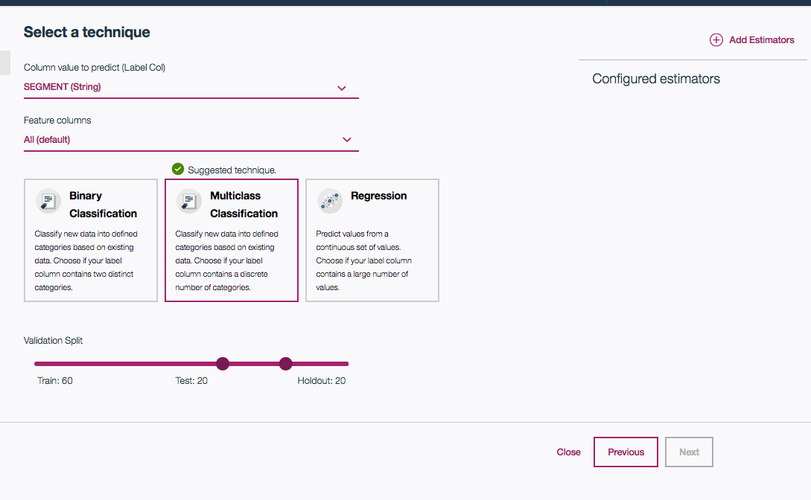

In the upper right corner, select **Add Estimators** and choose all 3 Estimators. Click **Add**

  

Once the technique and estimators have been selected, click **Next** to start training the model.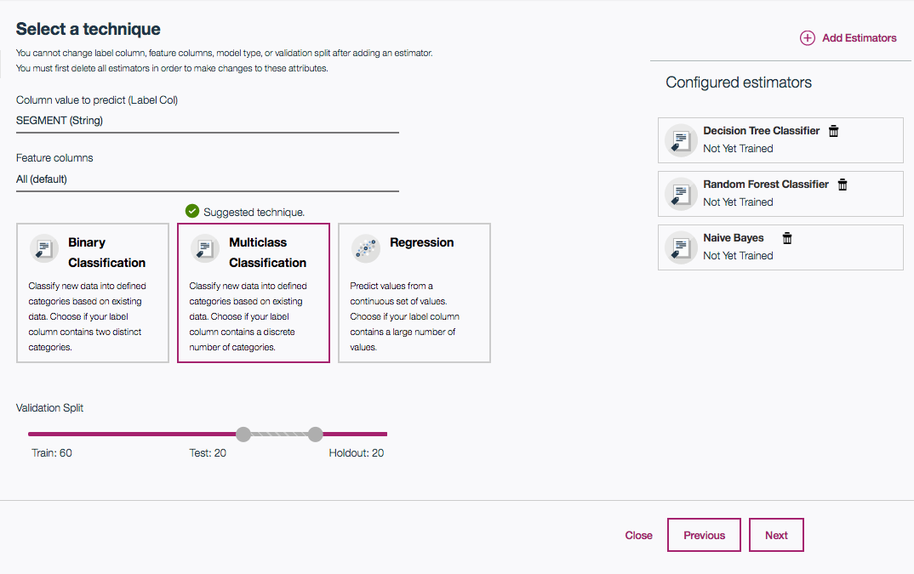

Watson will start training your model based upon the selected technique and estimators. Once complete, **Select** and **Save** the model which performed best.

Upon completion, you will be taken to the **"Overview"** page where you can see information about the model and dataset.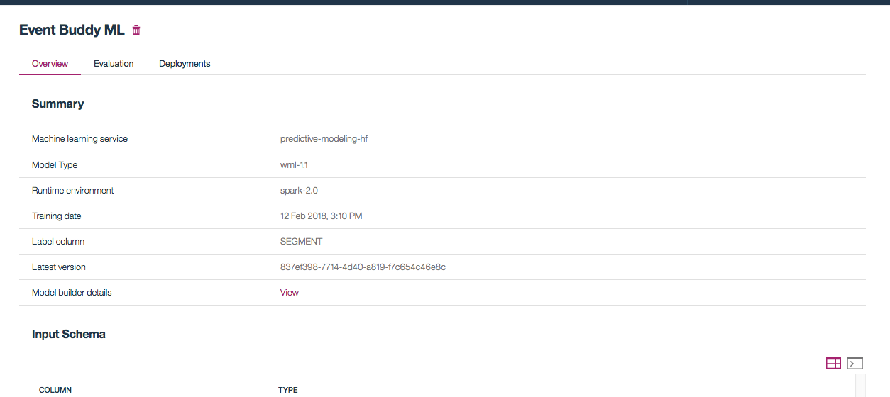

Select the **Deployments** tab, and click **Add Deployment** 

Select the **Web Service** tab and name the deployment **"Event Buddy Deployment"**. Click **Save**. 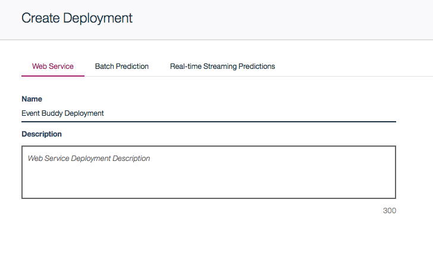

Your newly created deployment should now be listed.

Click on the deployment, and select the **Implementation** tab. Copy & save the **Scoring End-point** URL as you will need this later.

## 4. Configure Watson Conversation

Launch the **Watson Conversation** service. Use the **import** icon button the right

Find the local version of [`workspace-wcs-eventbuddy.json`](docs/workspace-wcs-eventbuddy.json) and select **Import**.

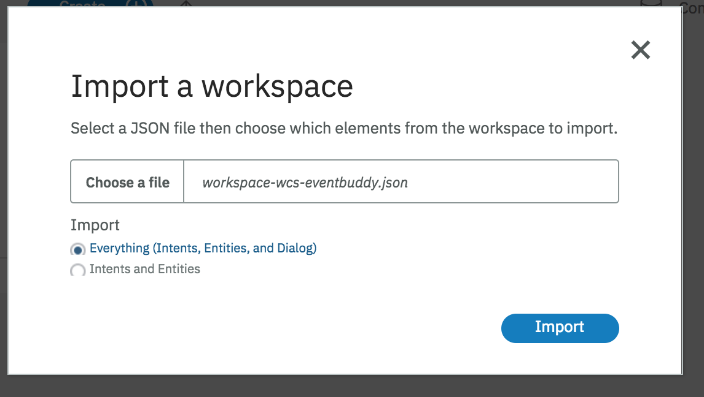

Upon successful import, you will see the pre-build Intents, Entities, and Dialog. 

Select **Back to Workspaces** to return to the homepage.

Within the **Ticketmaster3** tile, select **View Details**

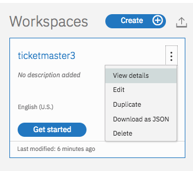

Save the **workspace ID** for later use. Your ID will be different.

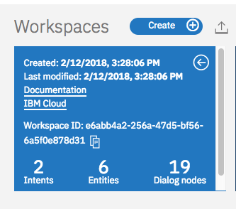

## 5. Register for Ticketmaster Service
One of the main functions of `Watson Event Buddy` is to search Ticketmaster for an event based upon a Machine Learning model that recommends what type of event a user may like. To find events we use the Ticketmaster Service. Register for a free account at [https://developer-acct.ticketmaster.com/user/register](https://developer-acct.ticketmaster.com/user/register)

Under your user settings, select **My Apps**

 

There you will find your **Consumer Key**. **Copy** and **Save** the key, as you will need it later.

 

## 6. Register for Twilio Service
One of the main functions of `Watson Event Buddy` is to text the link to purchase tickets to the user. To send SMS text messages, we use the Twilio service. Register for a free trial account at [https://www.twilio.com/try-twilio](https://www.twilio.com/try-twilio).

As part of the service, you will be assigned the following values, which you will need to **save**. They are accessible through your user account settings:
- Account SID
- Authentication Token

Lastly, you will need a Twilio supplied phone number, where all texts will originate from. To create one, navigate to the *Programmable SMS* option
in the context menu. **Save** this number as you will need it later.

By default, you will only be able to send SMS text messages to the phone
number you provided to create your account. To send messages to other
numbers, you need to add them at [https://www.twilio.com/console/phone-numbers/verified](https://www.twilio.com/console/phone-numbers/verified).
For each number you enter, the user of the number will be asked to verify
and then be sent a verification code. You will then need to enter this
verification code to complete the registration process.

## 7. Enable and Configure NodeRED service

Launch your previously provisioned [NodeRED Starter](https://console.bluemix.net/catalog/starters/node-red-starter)

Under Connections, **Create Connection** to the previous provisioned services: *Text to Speech*, *Watson Conversation*, *Machine Learning*

  

You connection list should look like the following. If asked to restage, select **Restage**.

Click **Visit App URL** to launch the nodeRED editor. Select a username and password to secure the editor

In order for text-to-speech to play audio sounds, we need to install an audio node. From the menu, select **Manage Palette**

  

Install `node-red-contrib-play-audio` node

Next we need to import the nodeRED flow [`EventBuddy-NodeRedFlow.json`](docs/EventBuddy-NodeRedFlow.json)

Copy and paste the contents of the file into the clipboard and select **Import**

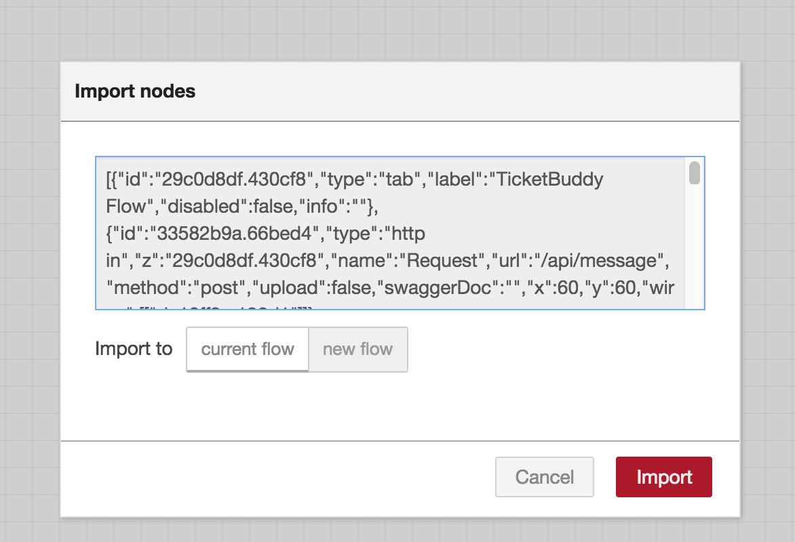

You should now see the Event Buddy NodeRED flow

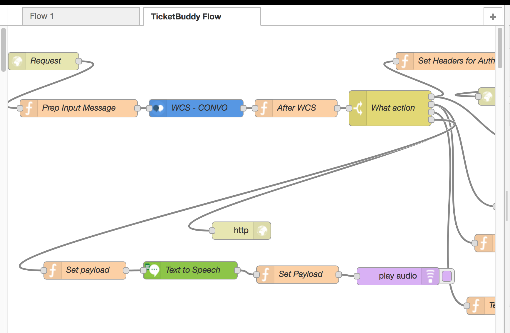

We now need to configure nodeRED to connect to our Watson Conversation Service. Double click the **WCS-CONVO** node.

  

Input your **Workspace ID**. You saved this ID, in Step 4: Configure Watson Conversation. Once done, select **Done**

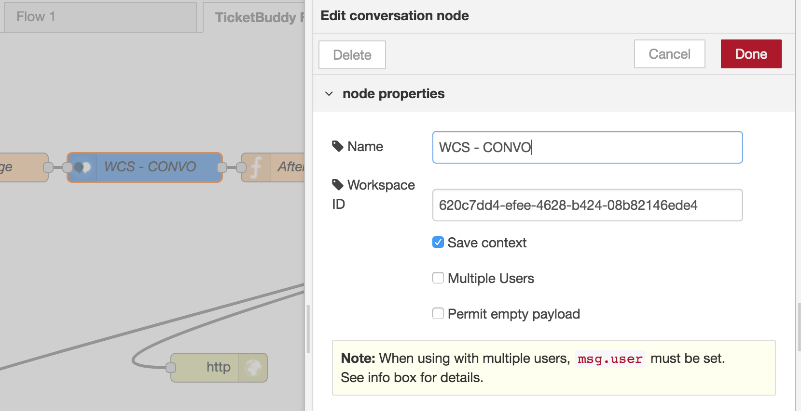

Next, we need our nodeRED flow to connect to our deployed Machine Learning Model. First we need to authenticate our ML Service. Double click **WML-Get Auth Key - SparkML** node.

  

Check **Use basic authentication** and input your **username** and **password** for your Machine Learning Service.

  

The values can be found in the service credentials section of your Machine Learning service.

Next, double click the **WML-SparkML** node.

  

Change the **URL** to the **scoring end-point url** for your deployed model. You saved this url in Step 3: Create Machine Learning Model. Once done, select **Done**

  

Next, we need to setup Ticketmaster API to use your unique Consumer key. You saved this key in Step 5: Register for Ticketmaster Service.

Double click **Set headers for TicketMaster** node. Replace the variable `apikey` with your unique Consumer key. Click **Done**

  

 Lastly, we need to update Twilio Service to use your account. Double click **Text User Event URL** and select **Add new twilio-api**.

 

   
 

Enter your **Account SID**, **From Phone Number** and **Authentication Token**. You saved these values in Step 6: Register for Twilio Service. Make sure to add the country code before the phone number. If it is a US number, 1 is the country code. Click **Add**

  

Upon completion, your node will look like the following. Note "SMS to" field is left empty. Click **Done**.

  

Your nodeRED Flow is Complete! Click **Deploy** to deploy your flow.

  

## 8. Deploy Client Application

The next step is to create a sample application that connects to your NodeRed flow. When you click on the button below, you will be taken to bluemix DevOps page. This will automatically create a new application for you, via the DevOps ToolChain. If you are not logged on to BlueMix you will need to logon. Note: This application does not work for Bluemix Lite Accounts due to memory constraints.

Click the deploy button, after about 1 minute or so, your screen will change to something like the following:

  

Click on the **Deliver** tile

  

Once the message in the deploy tile has changed to passed from Deploy running, click on the **Rocket** icon under **Last Executed Results**

  

This will take you to the newly created applications. Click on the **Runtime** link on the left and your screen should change, then click on **environment variables** tab in the middle of the screen. It should look like the following:

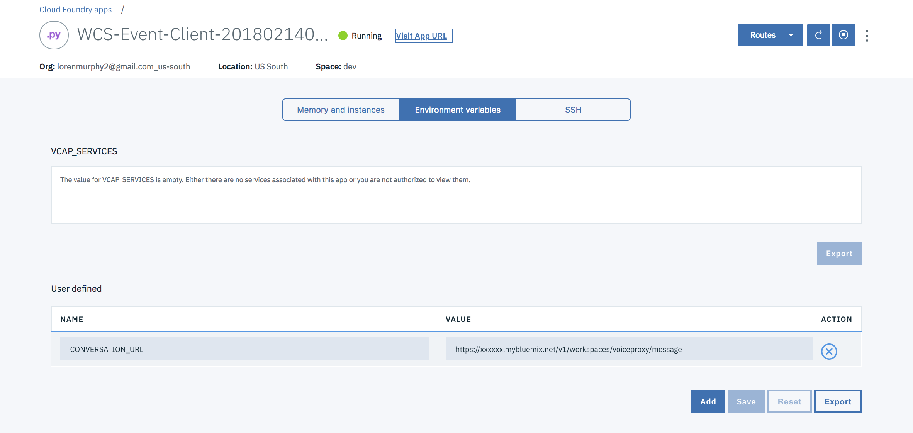

In the CONVERSATION_URL value, change to `https://xxxxxx.mybluemix.net/api/message`, where
"xxxxxx" is the hostname of your NodeRed application. This comes from the NodeRed url where you created your NodeRed flow. Do not include "/red/#. Your values will be different.

  

Click the **Save** button. The application will restart.

Click on the **Visit App URL**. This is at the top of the page. You will land on the following page.

  

# Sample Output

Textual version of a sample conversation with Watson Event Buddy:

  

  

Here is a recap of the services used to perform this conversation:
- **Node-RED:** Used to create a flow which tied together the various Watson services
- **Watson Conversation:** The conversation flow.
- **Watson Text-To-Speech:** Converts Event Buddy replies to sound.
- **Watson Machine Learning Model:** Based upon the user's information (age, gender, profession, martial status, and location) a type of event is recommended to the user (ie: music, arts, sports etc) using a ML model.
- **Ticketmaster Data:** Based upon when the user would like to attend the event, the city, and the type of event returned from ML model, Ticketmaster returns a list of upcoming events.  
- **Twilio:** Texts user the link to purchase the ticket for the show

# Troubleshooting

### Not hearing Watson read the text out-loud
Make sure a browser tab with the "Node-RED" flow is open. The audio output node selected within the flow requires the browser tab to be open.

### Ticketmaster does not return an event
Currently the start and end dates for ticketmaster API call are hard-coded. Within the node-RED flow, open the **Set headers for TicketMaster** node. Make sure the start and end date is set appropriately. The Ticketmaster API currently does not search for past events.

### Watson Conversation stops and does not return anything
Watson Conversation is currently coded for "happy-path" only. It is recommended you follow the sample output path above. You can further extend the Watson Conversation service to include "non-happy paths". For instance, the person does not want Watson's help in finding an event or they do not like the recommended type of event.

### Twilio is Not Texting user
Make sure the number you are texting has been registered within the Twilio Application. If not, add the number at [https://www.twilio.com/console](https://www.twilio.com/).
For each number you enter, the user of the number will be asked to verify
and then be sent a verification code. You will then need to enter this
verification code to complete the registration process.
