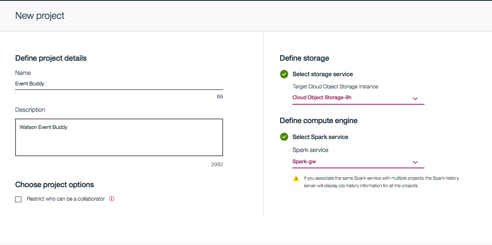
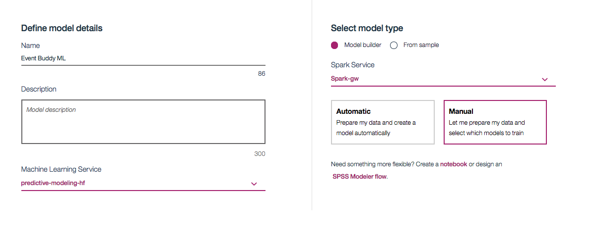
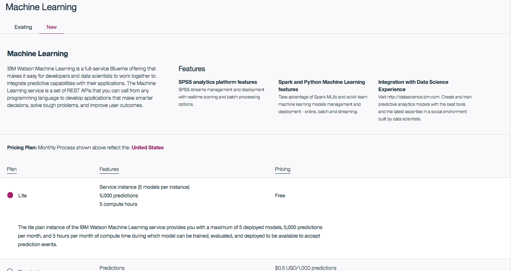
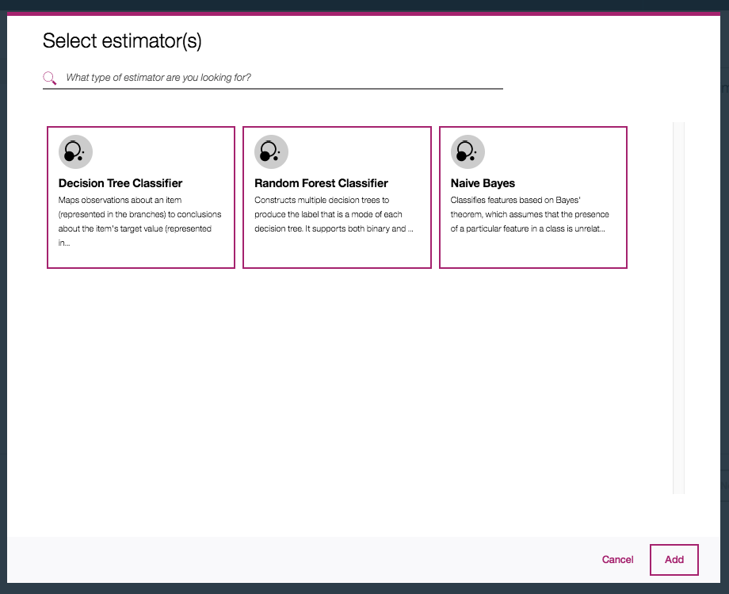
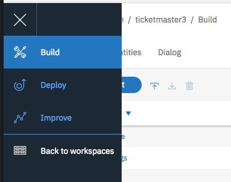
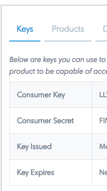

# Watson Event Buddy
In this developer journey we will build a Watson Event Buddy which is a cognitive chatbot designed to help users easily find and purchase event tickets based upon a recommendation machine learning model. Currently New York City and Chicago are the two supported cities.

When the reader has completed this journey, they will understand how to:

* Build a Event Buddy that converses uses Watson Conversation
* Use Watson Text to Speech to converse with Event Buddy
* Use Watson Machine Learning to recommend what type of event is of interest to the user (ie: art, music, sport)
* Use Ticketmaster to search for events based upon location, type and date
* Use Twilio to send SMS text messages with link to purchase tickets from Ticketmaster

### Included Components

* [Watson Conversation](https://www.ibm.com/watson/developercloud/conversation.html): Build, test and deploy a bot or virtual agent across mobile devices, messaging platforms, or event on a physical robot.
* [Watson Text to Speech](https://www.ibm.com/watson/developercloud/text-to-speech.html): Converts written text into natural sounding audio in a variety of languages and voices.
* [Node-RED](https://console.bluemix.net/catalog/starters/node-red-starter): A flow-based development tool for wiring together hardware devices, APIs and online.
* [Watson Machine Learning](https://www.ibm.com/cloud/machine-learning): Create, train, and deploy self-learning models

### Featured Technologies

* [Twilio](https://www.twilio.com/): Integrate voice, messaging, and VoIP into your web and mobile apps.
* [Ticketmaster](https://developer.ticketmaster.com/products-and-docs/apis/getting-started/): A leading provider platform for purchasing and selling event tickets for concerts, sports, arts, theater and other events.

# Watch the Video

# Steps
1. [Clone the repo](#1-clone-the-repo)
2. [Create the Bluemix Services](#2-create-bluemix-services)
3. [Create Machine Learning Model](#3-create-machine-learning-Model)
4. [Configure Watson Conversation](#4-configure-watson-conversation)
5. [Register for Ticketmaster Service](#5-Register-for-ticketmaster-service)
6. [Register for Twilio Service](#6-register-for-twilio-service)
7. [Enable NodeRED Service](#7-Enable-NodeRED-service)
8. [Deploy Front-End Application](#8-Enable-NodeRED-service)

## 1. Clone the repo

Clone the 'WatsonEventBuddy' locally. In a termainal, run:

`$ git clone https://github.com/loren-murphy/WatsonEventBuddy`

We’ll be using the files within the [`docs`](docs) folder.
* EventBuddy-NodeRedFlow.json
* Ticket_Data.csv
* workspace_wcs-eventbuddy.json

## 2. Create Bluemix services

Create the following services:
  * [**Node-RED Starter**](https://console.bluemix.net/catalog/starters/node-red-starter)
  * [**Watson Conversation**](https://console.ng.bluemix.net/catalog/services/conversation)
  * [**Watson Text to Speech**](https://console.ng.bluemix.net/catalog/services/text-to-speech/)

## 3. Create Machine Learning Model

1. Create or login to [Data Science Experience](https://datascience.ibm.com/) account

2. Create a **new project** called **"Event Buddy"**. If not already done, provision an Object Storage and Spark service. 

3. Click the **Assets** tab, and beside **Models** section, click **New Model**

4. Name the model **"Event Buddy ML"**. Select the Spark Service, Machine Learning Service and model type as **Manual**. When done, select **Create**

 If you do not have a Machine Learning Service Instance associated with the project, **provision an Instance**.

5. Now we need to upload the dataset to create the Machine Learning model. Select **Add Data Assets** and upload the [`Ticket_Data.csv`](docs/Ticket_Data.csv) file. When done, select **Next** 

6. Select **Segment (String)** as the column value to predict.Feature columns is **All (default)**. Select **Multiclass Classification** as the technique. 

7. In the upper right corner, select **Add Estimators** and choose all 3 Estimators. Click **Add**

8. Once the technique and estimators have been selected, click **Next** to start training the model.

9. Watson will start training your model based upon the suggested technique and estimators. Once complete, **Select** and **Save** the model which performed best.

10. Upon completion, you will be taken to the **"Overview"** page where you can see information about the model and dataset.

11. Select the **Deployments** tab, and click **Add Deployment** 

12. Select the **Web Service** tab and name the deployment **"Event Buddy Deployment"**. Click **Save**. 

13. Your newly created deployment should now be listed.

14. Click on the deployment, and select the **Implementation** tab. Copy & save the **Scoring End-point** URL as you will need this later.

## 4. Configure Watson Conversation

1. Launch the **Watson Conversation** tool. Use the **import** icon button the right

2. Find the local version of [`workspace-wcs-eventbuddy.json`](docs/workspace-wcs-eventbuddy.json) and select **Import**. Upon successful import, you will see the pre-build Intents, Entities, and Dialog. 

3. Select **Back to Workspaces** to return to the homepage.

4. Within the "Ticketmaster3" tile, select **View Details**

5. Save the **workspace ID** for later use

## 5. Register for Ticketmaster Service
One of the main functions of `Watson Event Buddy` is to search Ticketmaster for an event based upon a Machine Learning model that recommends what type of event a user may like. To find events we use the Ticketmaster Service. Register for a free account at [https://developer-acct.ticketmaster.com/user/register](https://developer-acct.ticketmaster.com/user/register)

Under your user settings, select **My Apps**

 

There you will your **Consumer Key**. Copy and Save the key, as you will need it later.

 

## 6. Register for Twilio Service
One of the main functions of `Watson Event Buddy` is to text the link to purchase tickets to the user. To send SMS text messages, we use the Twilio service. Register for a free trial account at [https://www.twilio.com/try-twilio](https://www.twilio.com/try-twilio).

As part of the service, you will be assigned the following values, which you will need to save, they are accessible through your user account settings:
- Account SID
- Authentication Token

Lastly, you will need a Twilio supplied phone number, where all texts will originate from. To create one, navigate to the *Programmable SMS* option
in the context menu.

- Twilio supplied phone number

By default, you will only be able to send SMS text messages to the phone
number you provided to create your account. To send messages to other
numbers, you need to add them at [https://www.twilio.com/console](https://www.twilio.com/).
For each number you enter, the user of the number will be asked to verify
and then be sent a verification code. You will then need to enter this
verification code to complete the registration process.

## 7. Enable Node-RED Service

## 8. Deploy Front-End Application

# Sample Output

Textual version of a sample conversation with Watson Event Buddy:

Here is a recap of the services used to perform this conversation:
-*Node-RED:* Used to program the various Watson services together
- *Watson Conversation:* The conversation flow.
- *Watson Text-To-Speech:* Converts Event Buddy replies to sound.
- *Watson Machine Learning Model:* Based upon the user's information (age, gender, profession, martial status, and location) a type of event is recommended to the user (ie: music, arts, sports etc) using a ML model.
-*Ticketmaster Data:* Based upon when the user would like to attend the event, the city, and the type of event returned from ML model, Ticketmaster returns a list of upcoming events.  
- *Twilio:* Texts user the link to purchase the ticket for the show

# Troubleshooting

### Not hearing Watson read the text out-loud
Make sure a browser tab with the "Node-RED" flow is open. The audio output node selected within the flow requires the tab to be open.

### Ticketmaster does not return an event
Currently the start and end dates for ticketmaster API call is hard coded. Within the node-RED flow, open the " " node. Make sure the start and end date is set appropriately. The Ticketmaster API currently does not search for past events.

### Watson Conversation stops and does not return anything
Watson Conversation is currently coded for "happy-path" only. It is recommended you follow the sample output path above. You can further extend the Watson Conversation service to include "non-happy paths". For instance, the person does not want Watson's help in finding an event or they do not like the recommended type of event.
